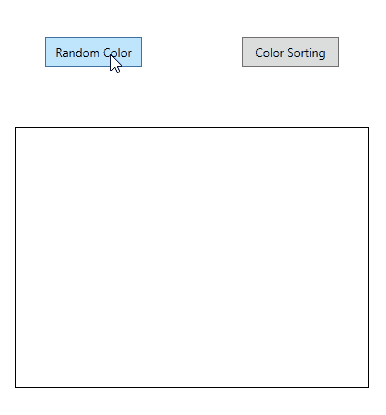

# Pixel Sort

A Proof of concept WPF application that generates random pixels and then sorts them based on the hue value.

This project was given to me as a take home coding test from a software company.



# Building from source

#### With visual studio

1. Open the solution in Visual studio.
2. Restore nuget packges
3. Build and run

#### With dotnet CLI

Verify you have dotnet cli by typing 

```powershell
dotnet
```

From the solution's root directory

1. Resotre the packages
```powershell
dotnet restore
```

2. Build the source

```powershell
dotnet build
```

3. Optionally, you can run the tests 

```powershell
dotnet test
```

4. Run the app with

```powershell
dotnet run --project .\PixelSort.App\
```

# Overview

The solution is divided into three projects

- PixelSort.App
	- contains the wpf application
- PixelSort.Domain
	- houses the application logic
- PixelSort.Doamin.Tests
	- xUnit project that contains the test for PixelSort.Domain


# Design decisions

-  I have used WritableBitmapSource to generate the image source. This class has a back buffer where the pixel informations are populated

- I have uses a TashFactory class to run the methods that generate random pixels and sorts them.

- I have used Microsoft.Extensions.DependencyInjection nuget package to set up DI containers.

- The PixelSortviewModel acts as a controller for the view.

- The Pixel class is the model. 

- The randomly generated pixels are created from first creating random RGBA values that is used to create a Color class. Then Pixels are created from a Color class instance. This has the benefit of using GetHue() method on the Color class to calculate the Hue value.

- The GetHue() methods returns Hue as Float type. The pixel class stores in as uint with BitConverter. This way it will be possible to use non-comparison based sorting algorithms likr Radix or Bucket sort.

- The Color Sorting button click handler first checks if the pixels are populated before attempting to sort them.

- If the pixels are already sorted, clicking the Color Sorting button will not sort the pixels again.

- I have notices the sorted image to be flipped 90 degrees to the left. To render this transformation, the PixelConverter class arranges the bytes from the sorted pixels in column first manner. The GetTransposedPixelsFromArgbColors method does this job.

# License

MIT license 

Permission is hereby granted, free of charge, to any person obtaining a copy of this software and associated documentation files (the "Software"), to deal in the Software without restriction, including without limitation the rights to use, copy, modify, merge, publish, distribute, sublicense, and/or sell copies of the Software, and to permit persons to whom the Software is furnished to do so, subject to the following conditions:

The above copyright notice and this permission notice shall be included in all copies or substantial portions of the Software.

THE SOFTWARE IS PROVIDED "AS IS", WITHOUT WARRANTY OF ANY KIND, EXPRESS OR IMPLIED, INCLUDING BUT NOT LIMITED TO THE WARRANTIES OF MERCHANTABILITY, FITNESS FOR A PARTICULAR PURPOSE AND NONINFRINGEMENT. IN NO EVENT SHALL THE AUTHORS OR COPYRIGHT HOLDERS BE LIABLE FOR ANY CLAIM, DAMAGES OR OTHER LIABILITY, WHETHER IN AN ACTION OF CONTRACT, TORT OR OTHERWISE, ARISING FROM, OUT OF OR IN CONNECTION WITH THE SOFTWARE OR THE USE OR OTHER DEALINGS IN THE SOFTWARE.

